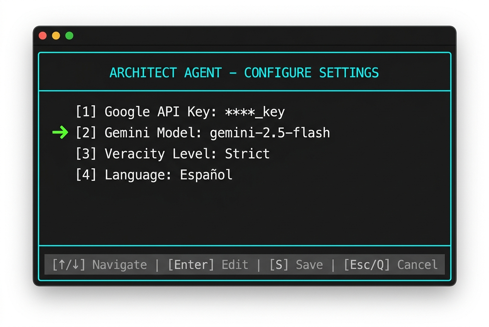
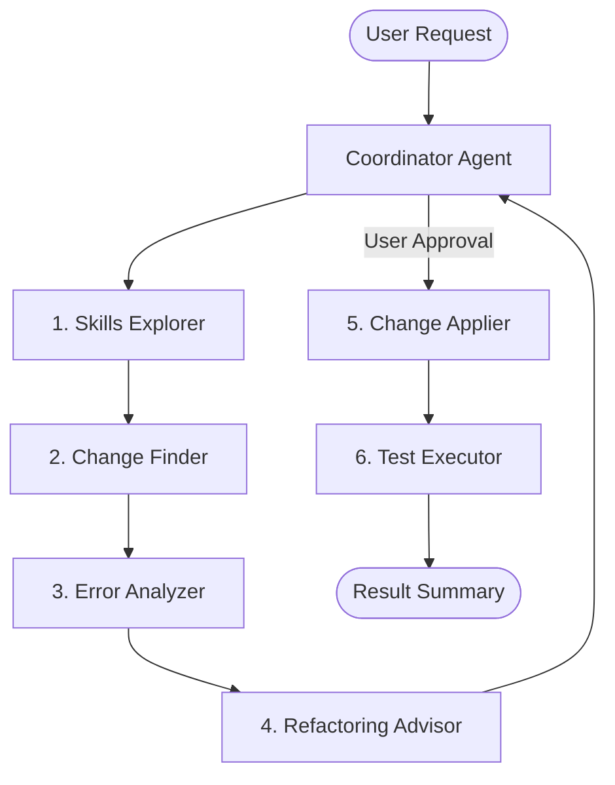

# Multi-Agent Code Reviewer (Hexagonal Architecture)

A CLI-based code reviewer application built with **Google ADK (Agent Development Kit)**. It coordinates a sequential pipeline of 6 specialized AI agents to analyze, propose, apply, and verify code changes based on project-specific design rules (skills). The codebase is structured using **Hexagonal Architecture** for dynamic path resolution, dependency injection, and clean unit testing.

---

## Quick Path

### 0. System Dependencies

Before setting up the project, ensure you have **Python 3.10+**, **Node.js 18+**, and **Git** installed on your operating system:

| Platform | Installation Method |
|----------|---------------------|
| **macOS** | Install via [Homebrew](https://brew.sh):<br>`brew install python git node` |
| **Linux (Ubuntu/Debian)** | Install via `apt`:<br>`sudo apt update && sudo apt install -y python3 python3-venv git nodejs npm` |
| **Windows** | Install via `winget` (or download official installers):<br>`winget install Python.Python.3.11`<br>`winget install Git.Git`<br>`winget install OpenJS.NodeJS` |

### 1. Install dependencies:
   ```bash
   python3 -m venv .venv
   .venv/bin/pip install google-adk python-dotenv pytest
   npm install
   ```
2. **Configure environment secrets**:
   Copy the environment variables template and add your Gemini API key:
   ```bash
   cp code_reviewer/.env.example code_reviewer/.env
   # Edit code_reviewer/.env and set your GOOGLE_API_KEY
   ```
3. **Launch the CLI**:
   ```bash
   npm run menu   # Or alternatively: python3 menu.py
   ```
4. **Run verification tests**:
   ```bash
   PYTHONPATH=.:code_reviewer .venv/bin/pytest
   ```

### Global Installation & OS-Specific Setup

To run the reviewer agent globally from the root of **any** project on your system without having to navigate back to the installer directory:

#### macOS

1. **Automated Link**: Run the installation script at the project root to create a symlink in `/usr/local/bin`:
   ```bash
   ./install.sh
   ```
2. **Path Verification**: Ensure `/usr/local/bin` is in your shell path (default in macOS). Run:
   ```bash
   code-reviewer
   ```
3. **Alternative Manual Setup**: If you prefer not to use `/usr/local/bin`, add the absolute path of this project's `bin/` directory to your shell configuration (`~/.zshrc` or `~/.bash_profile`):
   ```bash
   export PATH="/path/to/code_reviewer/bin:$PATH"
   ```

#### Linux (Ubuntu/Debian/Fedora)

1. **Automated Link**: Make the install script executable and run it:
   ```bash
   chmod +x install.sh
   ./install.sh
   ```
2. **Directory Check**: The script will prompt for your `sudo` password to create the symlink `/usr/local/bin/code-reviewer`. If `/usr/local/bin` is missing on your distribution, create it first:
   ```bash
   sudo mkdir -p /usr/local/bin
   ```
3. **Alternative Manual Setup**: If you don't have sudo access, append the project `bin/` directory directly to your `~/.bashrc` or `~/.profile`:
   ```bash
   echo 'export PATH="/path/to/code_reviewer/bin:$PATH"' >> ~/.bashrc
   source ~/.bashrc
   ```

#### Windows

You can configure the global executable either using PowerShell or the graphical user interface:

* **Option A: PowerShell (Recommended)**:
  Run PowerShell as Administrator and execute the following command to append the `bin/` folder path to your user environment variables:
  ```powershell
  [Environment]::SetEnvironmentVariable("Path", $env:Path + ";C:\path\to\code_reviewer\bin", "User")
  ```
  *Make sure to replace `C:\path\to\code_reviewer\bin` with the actual absolute path to the project's `bin/` directory on your drive.*

* **Option B: Windows Graphical UI**:
  1. Open the **Start Menu**, search for **"Environment Variables"**, and select **"Edit the system environment variables"**.
  2. Click the **"Environment Variables..."** button at the bottom.
  3. Under **"User variables"**, select the **`Path`** variable and click **"Edit..."**.
  4. Click **"New"** and enter the absolute path to this project's `bin/` folder (e.g., `C:\Users\YourName\Documents\code_reviewer\bin`).
  5. Click **"OK"** on all windows to apply.
  6. **Restart your terminal** (Git Bash, Command Prompt, or PowerShell) for the changes to take effect.
  7. Run:
     ```cmd
     code-reviewer
     ```

---

## Console UI & Option Instructions

When launching the interactive console UI (`npm run menu`), the following option menu is presented:



### Option Breakdown

* **1. Review Git Changes**: Triggers the `change_finder` agent to scan uncommitted git modifications (via git status & diff), runs the error analysis pipeline, and proposes changes.
* **2. Review Specific File**: Prompts for a relative file path, reads its source content, and runs the specialized agents sequence on that file.
* **3. List Project Design Skills**: Indexes and displays a summary of all active global (`~/.gemini/config/skills/`) and project-local (`.agents/skills/`) design guidelines.
* **4. Configure Settings**: Opens a dynamic configuration dashboard to customize the active LLM model, configure API Keys dynamically, select veracity levels, and toggle CLI languages. Inside the configuration menu, use **`S`** to Save and return, or **`Esc` / `Q`** to Cancel and discard changes.
* **5. Exit**: Safely quits the interactive console session.

---

## Multi-Model Support & Veracity Settings

The code reviewer features full support for multiple AI model providers and precise analysis strictness options, accessible via the interactive **Configure Settings** menu.

### Supported Models & Requirements

| Provider | Models | Extra Requirements |
|---|---|---|
| **Google Gemini** | `gemini-2.5-flash` (Default), `gemini-2.5-pro`, `gemini-1.5-flash` (Free developer tier) | None (uses built-in ADK client) |
| **Anthropic Claude** | `claude-3-5-sonnet`, `claude-3-5-haiku` | Requires Anthropic packages:<br>`.venv/bin/pip install "google-adk[extensions]"` |
| **OpenAI / Codex** | `openai/gpt-4o`, `openai/gpt-4o-mini` | Requires LiteLLM packages:<br>`.venv/bin/pip install "google-adk[extensions]"` |

### Dynamic API Key Fields

The configuration submenu dynamically adapts to your selected model. It will only ask for the keys needed for the active model (e.g. `ANTHROPIC_API_KEY` for Claude, `OPENAI_API_KEY` for OpenAI, and `GOOGLE_API_KEY` for Gemini), keeping your environment clean.

### Veracity & Accuracy Control

You can adjust how strict or creative the reviewer agents are by choosing a **Veracity Level**:

1. **Strict / Deterministic** (LLM Temperature: `0.0`): Best for bug audits and technical compliance. Minimizes hallucinations and focuses on exact code discrepancies.
2. **Balanced** (LLM Temperature: `0.4`): Balance between strict bug detection and descriptive code improvement explanations.
3. **Creative / Suggestions** (LLM Temperature: `0.7`): Ideal for brainstorming alternative algorithms, clean code refactorings, and design pattern proposals.

---

## Specialized Agent Pipeline

The execution flow is coordinated sequentially by a central **`coordinator_agent`** which delegates tasks to the following specialized agents:



1. **`skills_explorer`**: Reads and indexes global and local design guidelines (`read_project_skills`).
2. **`change_finder`**: Detects git status/diff and reads source code files (`get_git_changes`, `read_source_file`).
3. **`error_analyzer`**: Compares files against design guidelines to identify syntax bugs, logic errors, and structural deviations.
4. **`refactoring_advisor`**: Generates a refactoring proposal. If the changes are extensive (exceeding 50 lines of code or spanning multiple files), it designs a step-by-step **Incremental Refactoring Plan** so modifications can be verified incrementally.
5. **`change_applier`**: Modifies files on the filesystem (`write_source_file`) following the proposal or step-by-step incremental plan.
6. **`test_executor`**: Executes the test suite via the test runner adapter (`execute_unit_tests`) to verify correctness after changes.

---

## Architectural Layout

The project uses **Hexagonal Architecture** to decouple the core logic from external dependencies (I/O, VCS, shell executions):

| Component | Directory | Description |
|-----------|-----------|-------------|
| **Domain** | [`code_reviewer/domain/`](file:///Users/jhanncarlos/Documents/App/My%20Apps/code_reviewer/code_reviewer/domain) | Contains `CodeReviewToolsService` implementing pure domain use cases without system references. |
| **Ports** | [`code_reviewer/ports/`](file:///Users/jhanncarlos/Documents/App/My%20Apps/code_reviewer/code_reviewer/ports) | Defines secondary ports (`driven.py`, `test_runner.py`) and primary ports (`driving.py`). |
| **Adapters (Driven)** | [`code_reviewer/adapters/driven/`](file:///Users/jhanncarlos/Documents/App/My%20Apps/code_reviewer/code_reviewer/adapters/driven) | Concrete implementations for infrastructure (Git VCS, Pytest subprocess executing, OS FileSystem, and dynamic skills path expansion relative to the home directory). |
| **Adapters (Driving)** | [`code_reviewer/adapters/driving/`](file:///Users/jhanncarlos/Documents/App/My%20Apps/code_reviewer/code_reviewer/adapters/driving) | Facade wrapping tool executions with schemas matching ADK requirements (`tool_facade.py`). |
| **Composition Root** | [`code_reviewer/agent.py`](file:///Users/jhanncarlos/Documents/App/My%20Apps/code_reviewer/code_reviewer/agent.py) | Wire-up entrypoint connecting ports, adapters, and instantiating the specialized agents and coordinator loop. |

---

## Verification Checklist

- [ ] Unit tests pass cleanly in local environments (`6/6 passed`).
- [ ] Staging and environment credentials are separated (secrets ignored via `.gitignore`).
- [ ] No hardcoded absolute home directories are present.
- [ ] The CLI starts up without module resolution or path import issues.

---

## Next Steps

To add new design directives for the agents to enforce:
Create a markdown rules file (e.g., `MY_GUIDELINE_SKILL.md`) inside the global directory `~/.gemini/config/skills/` or a local directory `.agents/skills/`. The `skills_explorer` agent will automatically detect and apply the new guidelines in the next execution turn.
